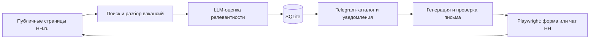

# HH AI Job Bot

**AI-powered HH.ru job monitoring and Telegram application assistant**

[](https://github.com/kavotavochavo1-ctrl/hh-ai-job-bot/actions/workflows/ci.yml)


[](LICENSE)

Личный Telegram-бот, который отслеживает новые вакансии на HH.ru, оценивает
их соответствие профилю кандидата через LLM, генерирует сопроводительные
письма и помогает отправлять отклики.

Проект работает на VPS в Docker, хранит состояние в SQLite и рассчитан на
одного владельца Telegram ID.

## Возможности

- несколько редактируемых поисковых профилей;
- поиск вакансий;
- каталог за последние семь дней, свежие вакансии показываются первыми;
- LLM-оценка релевантности от `0` до `100`;
- отдельные пороги для уведомлений и автоматического скрытия;
- генерация нейтральных сопроводительных писем длиной `500–800` символов;
- проверка русского языка, заглушек, посторонних алфавитов и необычных
  символов;
- ручной отклик по кнопке Telegram через Playwright;
- поддержка обычной формы HH и добавления письма через чат после мгновенного
  отклика;
- точная привязка действий к `vacancyId`, защита от клика по похожей вакансии;
- остановка при CAPTCHA, истёкшей сессии, тесте или неизвестной разметке;
- доступ только для одного разрешённого Telegram-пользователя.


## Архитектура



Основные компоненты:

- `HHWebClient` — читает публичную выдачу и страницы вакансий;
- `SearchService` — синхронизирует вакансии и поисковые профили;
- `ScoringService` — ставит LLM-оценку и применяет автоскрытие;
- `NotificationService` — отправляет новые подходящие карточки;
- `HHApplyService` — контролирует идемпотентность отклика;
- `PlaywrightHHBrowser` — работает с формой и iframe чата HH;
- `Repository` — изолирует хранение данных в SQLite.

## Стек

- Python 3.12
- aiogram 3
- Playwright
- HTTPX + BeautifulSoup
- SQLAlchemy Async + SQLite
- OpenRouter API
- APScheduler
- Docker Compose
- pytest + Ruff

## Быстрый старт

### 1. Подготовьте окружение

```powershell
git clone https://github.com/kavotavochavo1-ctrl/hh-ai-job-bot.git
cd hh-ai-job-bot
python -m venv .venv
.\.venv\Scripts\python.exe -m pip install -e ".[dev]"
Copy-Item .env.example .env
```

На Linux:

```bash
python3 -m venv .venv
./.venv/bin/python -m pip install -e ".[dev]"
cp .env.example .env
```

### 2. Настройте `.env`

Минимально необходимые переменные:

```dotenv
TELEGRAM_BOT_TOKEN=replace-with-rotated-token
TELEGRAM_USER_ID=123456789
OPENROUTER_API_KEY=replace-with-openrouter-key
OPENROUTER_MODEL=deepseek/deepseek-v4-flash
OPENROUTER_SCORING_MODEL=deepseek/deepseek-v4-flash
```

Отредактируйте `candidate_profile.md`: этот текст используется при оценке
вакансий и создании сопроводительных писем.

### 3. Проверьте проект

```powershell
.\.venv\Scripts\python.exe -m pytest -q
.\.venv\Scripts\python.exe -m ruff check src tests scripts
```

### 4. Запустите через Docker

```bash
docker compose up -d --build
docker compose ps
docker compose logs --tail=100 bot
```

База и HH-сессия хранятся в постоянном volume `bot-data`.

## Сессия HH для откликов

OAuth-приложение HH не требуется: поиск использует публичные страницы.
Для откликов нужна локально созданная браузерная сессия без сохранения пароля:

```powershell
.\.venv\Scripts\python.exe -m playwright install chromium
.\.venv\Scripts\python.exe scripts\capture_hh_session.py
```

После входа появится `hh_storage_state.json`. Это секрет уровня пароля:
никогда не публикуйте файл и передавайте его на сервер только защищённым
способом.

По умолчанию включён `HH_APPLY_DRY_RUN=true`. В этом режиме бот не нажимает
новый отклик, поскольку HH может создать его мгновенно. Для реальной отправки
используйте `HH_APPLY_DRY_RUN=false` только после проверки сессии.

## Команды Telegram

| Команда | Назначение |
|---|---|
| `/start` | Краткая справка |
| `/help` | Все доступные команды |
| `/vacancies` | Свежий каталог |
| `/hidden` | Скрытые вакансии |
| `/profiles` | Управление поисковыми профилями |
| `/threshold` | Порог уведомлений |
| `/hide_threshold` | Порог автоматического скрытия |
| `/status` | Состояние мониторинга |

В карточках доступны переоценка, скрытие, ссылка на HH и генерация
сопроводительного. Отправка запускается только отдельной кнопкой
`📨 Отправить на HH`.

## Тестирование

Тесты не обращаются к реальным Telegram, OpenRouter и HH:

```powershell
.\.venv\Scripts\python.exe -m pytest -q
```

Покрыты репозиторий, фильтры, каталог, генерация и валидация писем,
идемпотентность, HTML-клиент, Telegram-handlers, обычная форма HH и iframe
чата.

GitHub Actions запускает pytest и Ruff для каждого push в `main` и каждого
pull request.

## Безопасность

- `.env`, SQLite, browser storage state и локальные virtualenv исключены из
  Git;
- токен Telegram, OpenRouter key и HH-сессия не выводятся в логи;
- опубликованный ключ необходимо немедленно отозвать, даже если commit удалён;
- успешный отклик блокирует повторную отправку;
- при неопределённом результате Playwright не повторяет финальный клик.

Дополнительные правила описаны в [SECURITY.md](SECURITY.md).

## Ограничения

- HH может менять HTML и `data-qa`, поэтому browser flow требует поддержки;
- CAPTCHA и антибот-защита намеренно не обходятся;
- проект рассчитан на одного пользователя;
- OpenRouter требует действующий ключ и положительный баланс;
- автоматизация откликов должна использоваться ответственно и в соответствии
  с правилами площадки;
- проект не является официальным продуктом HH.ru и не связан с компанией HH.

## Лицензия

Проект распространяется по лицензии [MIT](LICENSE).
